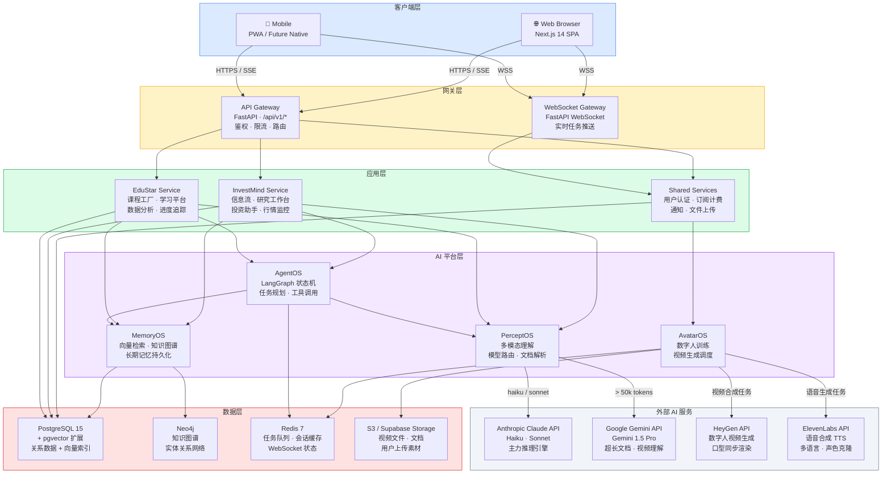
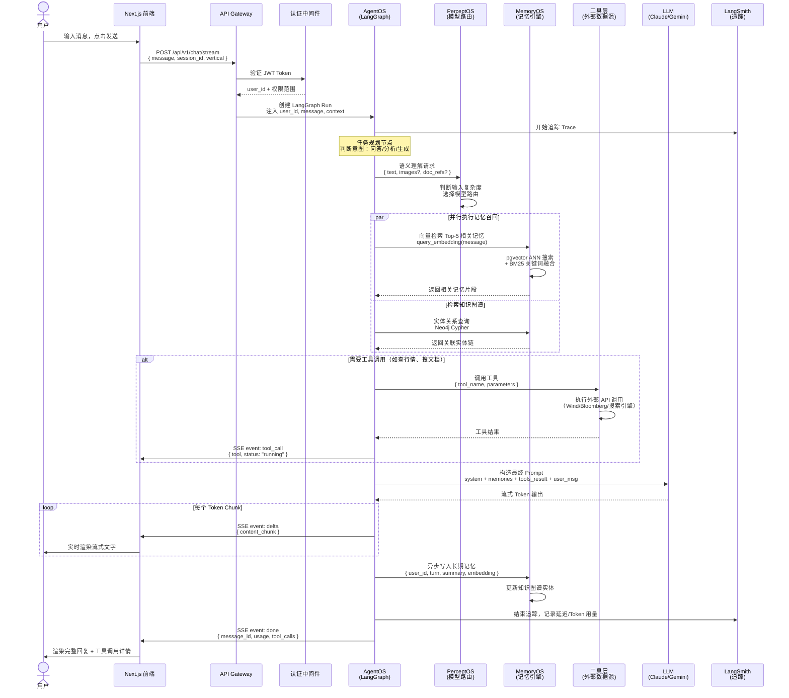
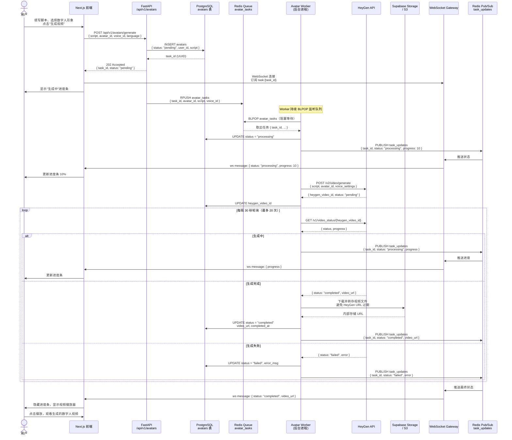
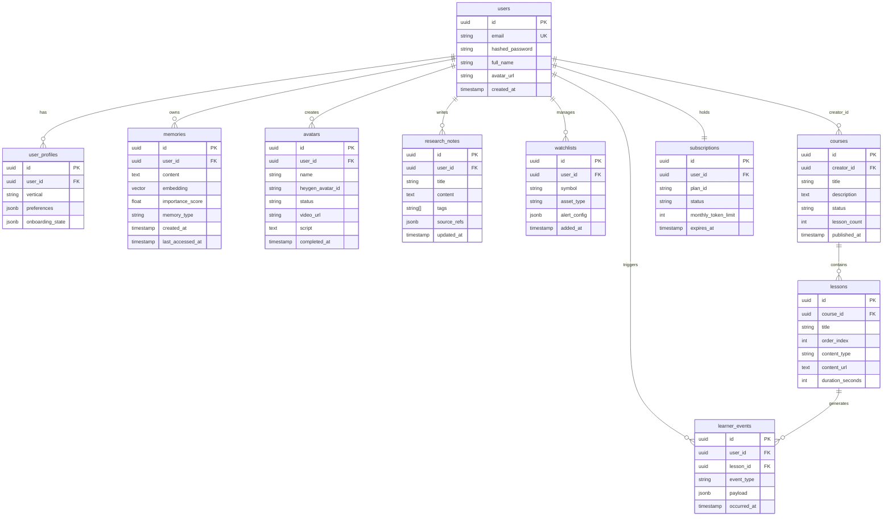
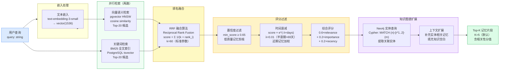
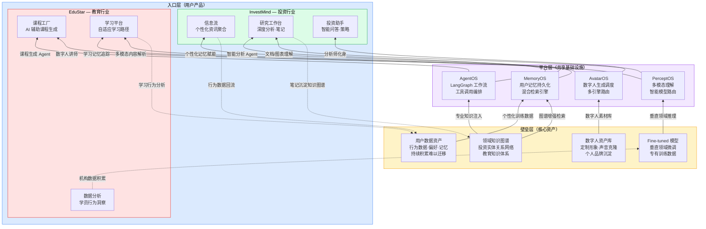

# Drama Factory — 系统架构图集

本文档包含 Drama Factory 平台的 6 张核心架构图，覆盖系统全景、数据流、异步流水线、数据模型、AI 检索机制和产品分层结构。所有图使用 Mermaid 语法，可在 GitHub / Notion / VS Code 中直接渲染。

---

## 图1：系统架构全景（C4 Container 风格）

**说明：** 采用分层视角展示整个平台的容器关系。从用户端浏览器/移动端出发，经过统一网关进入两条垂直业务线（InvestMind / EduStar），业务线共享同一套 AI 平台引擎，最终连接多类存储和外部 AI 服务。关键设计原则：垂直业务层共享 AI 平台层，但各自拥有独立的业务逻辑和数据表。

---

## 图2：数据流图 — 用户消息完整生命周期

**说明：** 描述从用户发送一条消息到收到 AI 回复的完整链路。核心设计：AgentOS 先做任务规划，PerceptOS 做语义理解和模型路由，MemoryOS 在推理前召回相关记忆（RAG），推理后将新对话写入长期记忆，最终通过 SSE 流式返回。整个链路通过 LangSmith 全程追踪。

---

## 图3：数字人视频生成流水线

**说明：** 数字人视频生成是典型的长时异步任务（通常需要 3-10 分钟）。设计要点：API 立即返回 task_id，客户端通过 WebSocket 订阅任务状态，后端 Worker 独立处理生成逻辑并轮询 HeyGen，完成后通过 Redis Pub/Sub 触发 WebSocket 推送，避免前端轮询浪费资源。

---

## 图4：数据库 ERD（核心表关系）

**说明：** 以 `users` 表为中心的星形关系模型。`memories` 表使用 pgvector 的 `vector(1536)` 类型存储嵌入向量，支持 ANN 近似最近邻查询。`learner_events` 是事件溯源表，记录所有学习行为用于分析。`subscriptions` 控制功能访问权限和 API 用量上限。

---

## 图5：MemoryOS 混合检索流程

**说明：** MemoryOS 采用三阶段混合检索策略以兼顾精确性和召回率。第一阶段并行执行向量语义检索（pgvector HNSW 索引）和关键词精确检索（BM25），通过 RRF（Reciprocal Rank Fusion）算法融合双路结果；第二阶段用知识图谱扩展相关实体；第三阶段执行置信度过滤和时间衰减评分后返回 Top-K 结果。

---

## 图6：产品矩阵三层架构

**说明：** 从下往上读：底层是难以复制的核心壁垒（数据和 AI 能力），中间层是共享的 AI 平台基础设施，顶层是面向用户的差异化产品入口。数据从上层产品流向下层沉淀，AI 能力从下层向上层赋能，形成飞轮效应。两个垂直产品共享同一 AI 平台层，降低边际成本。

---

*最后更新：2026-05-22 | 维护者：Architecture Team*
